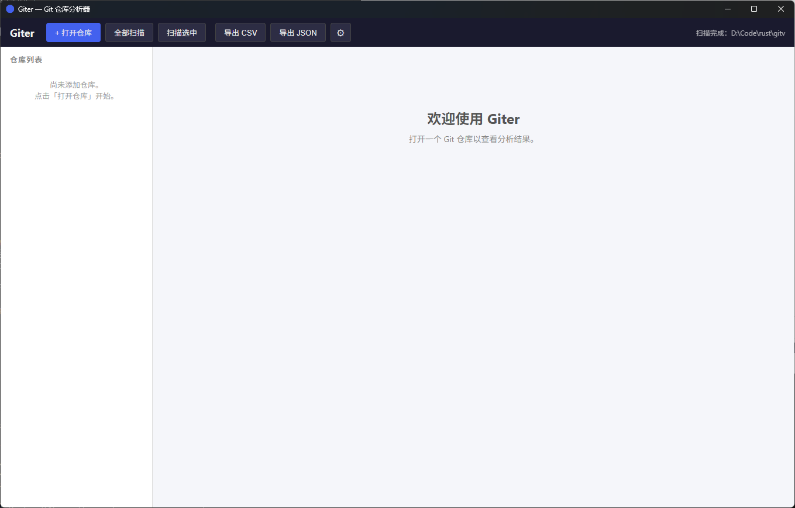
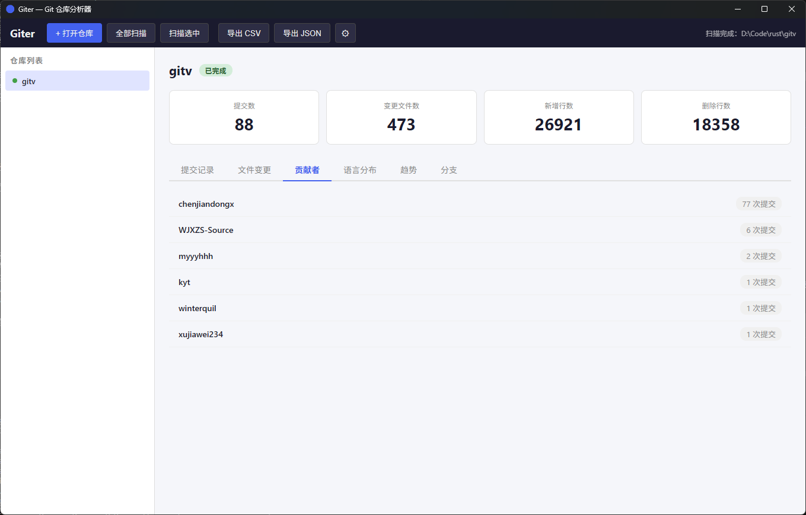
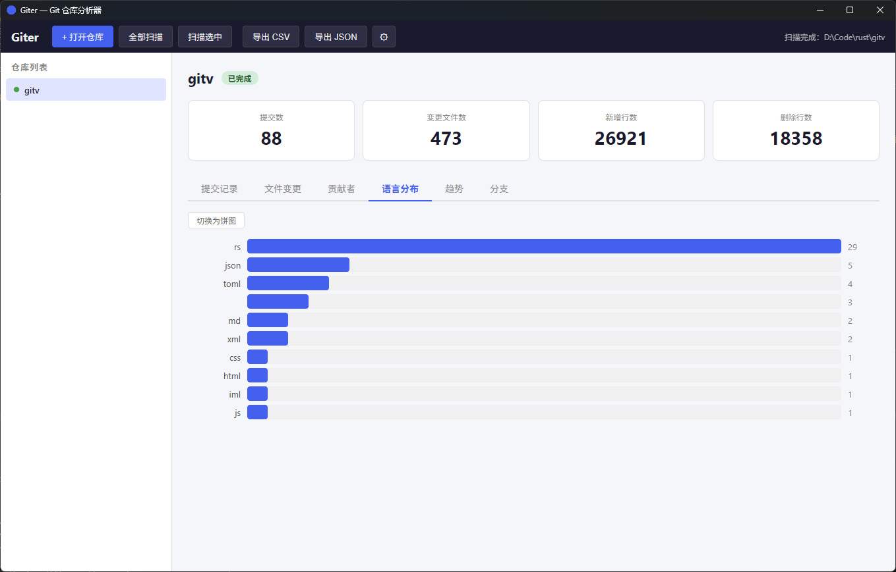
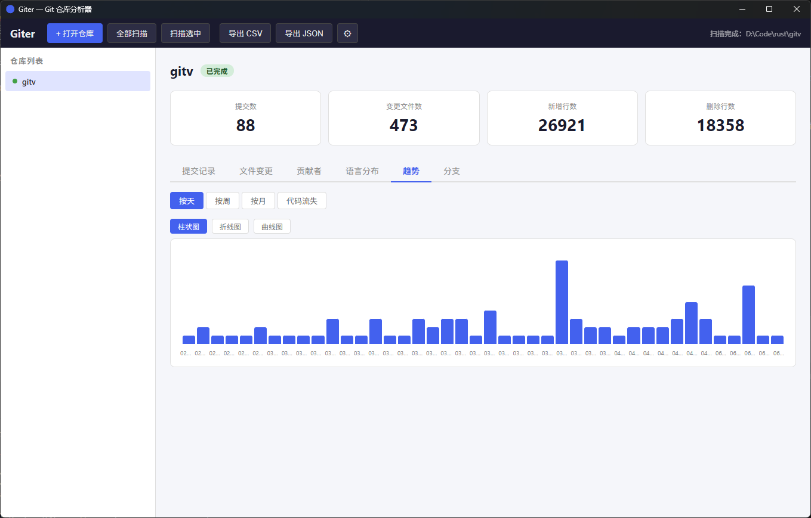

# Giter — Git 仓库分析器

**这是 2026 Rust程序设计实训课程大作业**

在 https://github.com/chenjiandongx/gitv 的基础上进行再开发

[](https://www.rust-lang.org)
[](https://v2.tauri.app)
[](LICENSE)

**Giter** 是一个纯 Rust 编写的本地 Git 仓库分析桌面工具，基于 **Tauri 2.11.2** 框架构建。支持多仓库管理、交互式数据可视化，帮助开发者快速了解仓库的提交活跃度、贡献者分布、代码语言组成和代码变动趋势。



## 功能

- **多仓库管理** — 通过原生对话框选择 Git 仓库目录，支持添加/删除/多仓库管理
- **Git 历史扫描** — 使用 `git2` 库扫描仓库的提交记录、文件变更和文件快照
- **6 个分析面板：**

  | 面板 | 内容 |
  |------|------|
  | 提交记录 | hash、作者、日期、提交信息，支持搜索和列排序 |
  | 文件变更 | 文件路径、增删行数（绿色/红色标注）、提交哈希 |
  | 贡献者 | 按作者统计提交数，一目了然 |
  | 语言分布 | 文件类型分布，支持柱状图/饼图两种模式 |
  | 趋势 | 按天/周/月查看提交趋势和代码流失，支持柱状图/折线图/曲线图 |
  | 分支 | 本地/远程分支分组展示，当前分支高亮 |

- **数据导出** — 支持导出为 CSV 和 JSON 格式
- **搜索过滤** — 按提交信息、作者、哈希模糊搜索
- **设置持久化** — 窗口偏好和最近仓库列表自动保存

## 截图

| 贡献者统计 | 语言分布（饼图） | 趋势图（折线图） |
|---|---|---|
|  |  |  |

## 技术栈

| 层 | 技术 | 说明 |
|---|---|---|
| 桌面框架 | **Tauri 2.x** | Rust 后端 + 系统原生 WebView |
| 前端 | **HTML + CSS + JS** | 无框架/无 bundler，图表使用内联 SVG 和 CSS 手写实现 |
| Git 交互 | **git2** (libgit2) | 类型安全的 Git 仓库操作 |
| 原生对话框 | **rfd** | 跨平台文件夹/文件选择器 |
| 序列化 | **serde + serde_json + csv** | 数据结构序列化及导出 |
| 时间处理 | **chrono** | 时间戳解析和日期聚合 |
| 错误处理 | **thiserror** | 统一错误模型，零 unwrap |

## 快速开始

### 前置依赖

- [Rust](https://www.rust-lang.org/tools/install) 1.75+
- [Git](https://git-scm.com/)
- 构建 Tauri 应用所需的系统依赖，请参考 [Tauri 官方文档](https://v2.tauri.app/start/prerequisites/)

### 构建与运行

```bash
# 克隆项目
git clone https://github.com/ReaderQW/gitv.git
cd gitv

# 运行开发模式（带热重载）
cargo tauri dev

# 生产构建
cargo tauri build
```

### 运行测试

```bash
# 运行全部测试
cargo test --workspace

# 仅运行核心库测试
cargo test -p giter-core

# 仅运行应用层测试
cargo test -p giter-app
```

## 项目结构

```
gitv/
├── Cargo.toml                          # workspace 根
├── crates/
│   ├── giter-core/                     # 核心库：零 GUI 依赖
│   │   ├── src/
│   │   │   ├── git/                    # Git 扫描模块
│   │   │   │   ├── scanner.rs          #   扫描入口
│   │   │   │   ├── commit.rs           #   遍历 commits（revwalk）
│   │   │   │   ├── change.rs           #   diff 变更分析
│   │   │   │   └── snapshot.rs         #   HEAD 快照（代码/注释/空行）
│   │   │   ├── model/                  # 数据结构（Serialize + Deserialize）
│   │   │   ├── analysis/               # 指标计算
│   │   │   │   ├── trends.rs           #   提交趋势（按天/周/月）
│   │   │   │   ├── contributors.rs     #   贡献者统计
│   │   │   │   ├── code_churn.rs       #   代码流失
│   │   │   │   └── file_types.rs       #   文件类型分布
│   │   │   ├── export/                 # CSV/JSON 导出
│   │   │   │   ├── csv.rs
│   │   │   │   └── json.rs
│   │   │   └── error.rs                # 统一错误处理
│   │   └── tests/                      # 集成测试
│   └── giter-app/                      # Tauri 桌面应用
│       ├── src/
│       │   ├── main.rs                 # 应用入口
│       │   ├── lib.rs                  # 13 个 IPC 命令 + Tauri builder
│       │   └── state/                  # 状态管理
│       │       ├── app_settings.rs     #   配置持久化
│       │       ├── selected_repos.rs   #   仓库路径集合
│       │       └── scan_result.rs      #   扫描状态（四态枚举）
│       ├── tauri.conf.json             # Tauri 窗口配置
│       └── frontend/                   # 前端静态文件
│           ├── index.html              # DOM 结构
│           ├── style.css               # 全部样式
│           └── app.js                  # IPC 调用 + DOM 渲染
```

## 架构设计

```
  [原生 WebView 前端]
        |  JSON-RPC (invoke)
  [Tauri 2.x 核心] (giter-app)
        |  调用 giter-core API
  [giter-core 分析引擎]
        |  通过 git2
  [Git 仓库 (文件系统)]
```

- **giter-core** 是核心分析引擎，不依赖任何 GUI 框架，可独立测试，也可扩展为 CLI 版本
- **giter-app** 是薄 Tauri 壳层，通过 `#[tauri::command]` 暴露 13 个 IPC 命令
- 前后端通信：前端通过 `window.__TAURI__.core.invoke()` 调用后端，数据格式通过 `#[serde(tag, content)]` 严格对齐
- 图表全部使用内联 SVG 和 CSS 手写实现（柱状图/折线图/曲线图/饼图），无第三方图表库依赖

## 测试覆盖

项目包含 **63 个测试**，全部通过：

| 模块 | 数量 | 覆盖内容 |
|------|------|---------|
| giter-core 单元测试 | 42 | 扫描、分析、导出 |
| giter-core 集成测试 | 5 | 扫描→导出→读回验证 |
| giter-app 单元测试 | 16 | 状态管理（设置、仓库、扫描结果） |

```bash
$ cargo test --workspace
test result: ok. 63 passed; 0 failed
```

## 使用的 Rust 特性

| 特性 | 项目中的体现 |
|------|------------|
| **所有权/借用** | `scan_repository(&Path) -> RepoRawData` — 函数入参借用路径，返回拥有数据的结构体 |
| **枚举 + 模式匹配** | `ScanState` 四态枚举 + `match` 分发，编译器保证状态覆盖完整 |
| **派生宏** | `#[derive(Serialize, Deserialize)]` 一行代码让所有数据结构支持序列化 |
| **属性宏** | `#[tauri::command]` 自动将 Rust 函数注册为 IPC 路由 |
| **泛型 + Trait** | `to_file<T: Serialize>()` — 一个函数导出任意数据类型 |
| **错误处理** | `thiserror` + `CoreResult<T>` + `?` 操作符，零 unwrap |

## 许可

MIT / Apache-2.0
